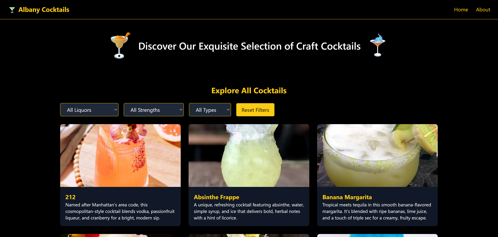
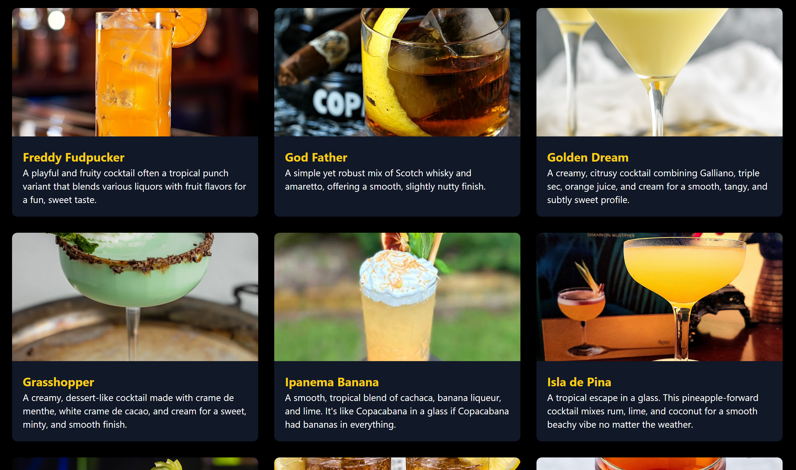
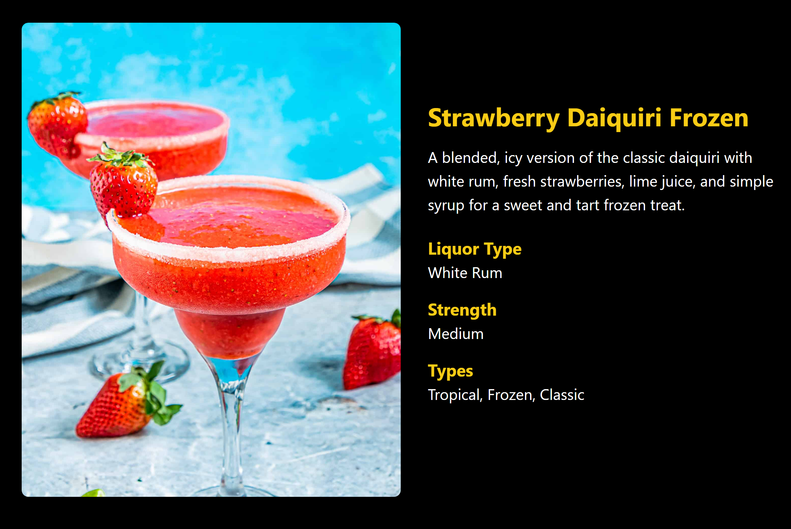

# Albany Cocktail Menu

A mobile-friendly cocktail menu built with React, Tailwind CSS, and AWS designed so guests at my home can scan a QR code and browse all the drinks I can make for them.



---

## Purpose

I created this app as a personal, scannable **cocktail menu for friends visiting my home**. Instead of flipping through notes or reciting from memory, guests can scan a **QR code** at the bar and instantly view drink options complete with photos, ingredients, and fun names.

---

## Technologies & Tools Used

| Layer         | Stack / Tools |
|--------------|---------------|
| **Front-End** | React, Tailwind CSS, React Router |
| **Database**  | AWS DynamoDB |
| **Auth & Security** | AWS Cognito (unauthenticated identity access) |
| **Cloud Tools** | AWS SDK (DynamoDB access), AWS CLI |
| **QR Code** | [qrcode.react](https://www.npmjs.com/package/qrcode.react) |
| **Deployment** | Vercel |
| **Dev Tools** | PowerShell scripting, JSON data modeling |

---

## Features

- **Mobile-First Design** – Easily browsable on any phone or tablet
- **Cocktail Filtering** – Filter by liquor type, strength, or style
- **Cocktail Details** – View ingredients, images, and descriptions
- **Dynamic Data** – Cocktail list powered by AWS DynamoDB
- **Image Gallery** – Visual drink menu with high-quality photos
- **Secure Access** – AWS Cognito identity management
- **Automated Uploads** – PowerShell script + AWS CLI for bulk loading drinks
- **Deployed on Vercel** – [Live Site](https://albany-cocktail-menu.vercel.app)

---

## Screenshots

| Feature | Preview |
|--------|---------|
| Cocktail Grid |  |
| Cocktail Detail Page |  |
| QR Code Page |  |

---

## How It Works

1. **Scan the QR Code** placed on my coasters or fridge.
2. **Browse drink options** (cocktails only wines by verbal request).
3. **Filter by your vibe** – want something strong, sweet, or tropical?
4. **Order from the bartender** (me) based on what's listed. Cheers!

---

## Getting Started Locally

```bash
git clone https://github.com/your-username/albany-cocktail-menu.git
cd albany-cocktail-menu
npm install
npm start
